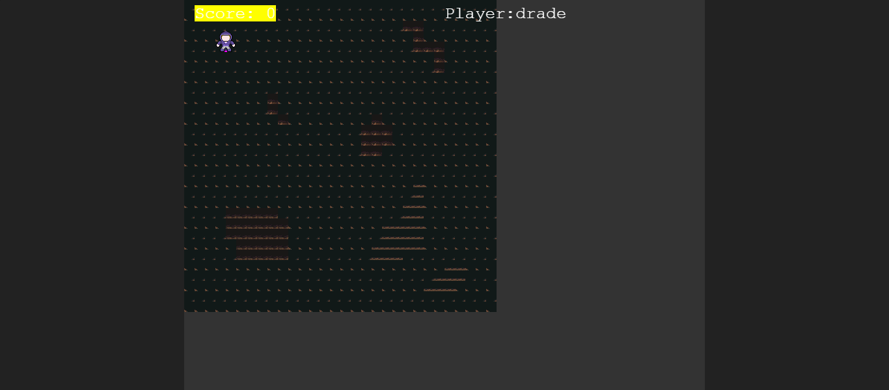

# README

 

# Turn based RPG-game

# This Project is turn based rpg game build using phaser 3 for Microverse JavaScript capstone project.

## Project Description

The project is initialized by running `npm install webpack webpack-cli --save-dev` to install webpack to the node_modules directory of your project.
A `src and dist` is created in the directory with the following contents:
- index.js file in src.
- index.html file in dist. 
- main.js is by generated by webpack when you run `npm run build`.
- A `webpack.common.js` is created to do the basic configurations.
- An HTML skeleton inside of `dist/index.html` file.
## 

## Built With

- JavaScript ES6
- Phaser 3
- Jest
- HTML
- CSS
- Bootstrap
- WebPack bundler

## Prerequisities

To get this project up and running locally, you must have  yarn, npm and node installed on your computer.

## Getting Started

**To get this project set up on your local machine, follow these simple steps:**

**Step 1** 
Navigate through the local folder where you want to clone the repository and run
`git clone https://github.com/uimarshall/phaser3-tb-rpg-games`. 

**Step 2** 
`phaser3-tb-rpg-games`. 

**Step 3** 
Run `npm install` to install the packages from the `package.json`. 

**Step 4** 
Run `npm start` to open the application in a browser of your choice. 

**Step 5** 
You can navigate to `http://localhost:8080/` to see your application running 

## Game Instructions(How to play)

Press the right or left arrow keyboard keys on your computer to jump between platforms. As you collect more coins the number of bombs increases to make the game enter hard mode.
Collect coins to gain points. Avoid the firebombs. You risk losing the game.

## Link to Live Demo:

[Demo](https://uimarshall.github.io/phaser3-tb-rpg-games/)

## Authors

👤 **Marshall Akpan**

- Github: [uimarshall](https://github.com/uimarshall)
- Twitter: [uimarshall](https://twitter.com/uimarshall)
- Linkedin: [Marshall Akpan](https://www.linkedin.com/in/marshall-akpan-19745526/)

## 🤝 Contributing

Our favourite contributions are those that help us improve the project, whether with a contribution, an issue, or a feature request!

Feel free to check the [issues page](https://github.com/uimarshall/phaser3-tb-rpg-games/issues) to either create an issue or help us out by fixing an existing one.

## Show your support

If you've read this far....give a ⭐️!

## :clap: Acknowledgements

- Microverse
- Phaser

## Game Dev and Design
Concept: A platform game where called the treasure of condor, it depicts a treasure hunter looking for tresures.
The game is built using Phaser library

## How to run the unit test
Fork/Clone this project to your local machine with the command git clone `https://github.com/uimarshall/phaser3-tb-rpg-games`

- cd into the project directory
- Open the terminal in your project directory
- Make sure you have node installed
- Run npm install on the terminal to install all dependencies
- Type npm run test on the terminal to run the unit test

## Final Game idea

An endless level. The treasure hunter hopes to gather as many tresure as possible, but it is impossible. He must find a way to deal with the obstacles confronting it, no way around it.
The treasure hunter must jump between platforms to avoid chasms and bombs while grabbing as most coins as possible.

## 📝 License

This project is licensed by Microverse and the Odin Project

- ...
