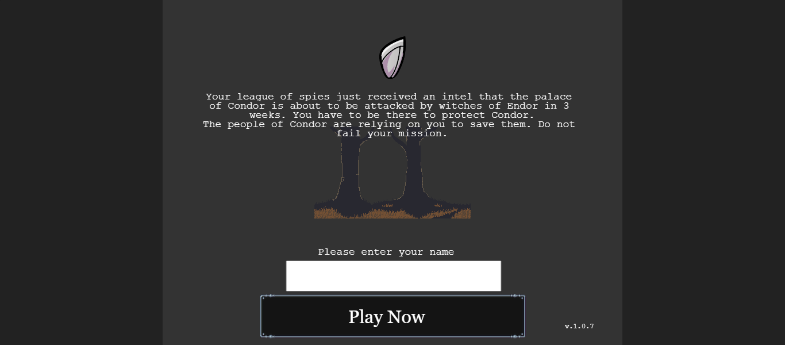
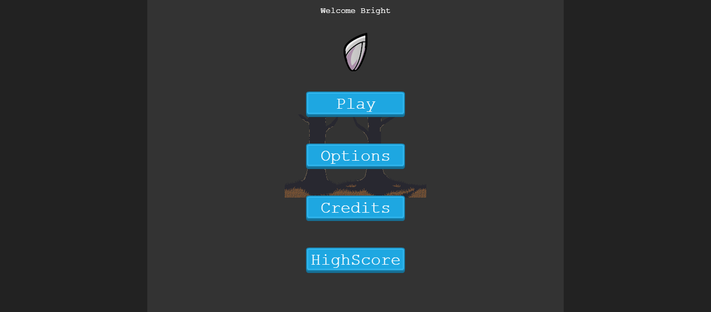
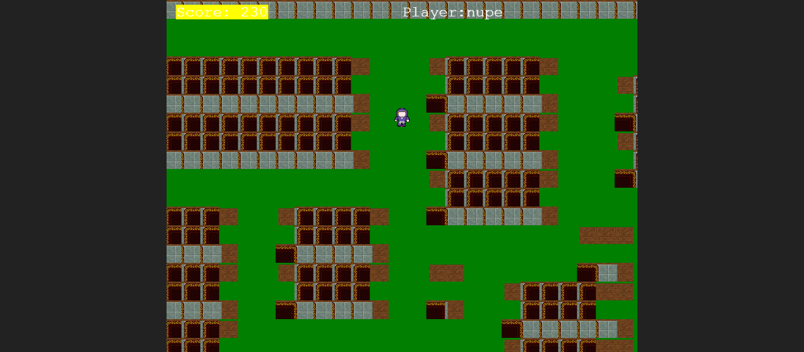
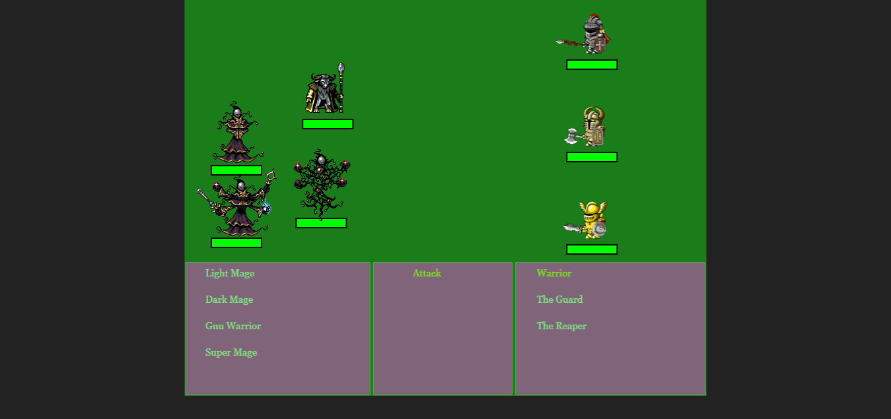
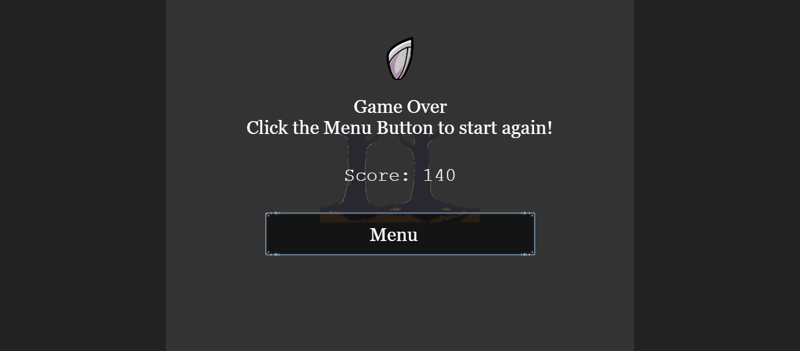

# README

 

# Turn based RPG-game

This Project is turn based rpg game build using [phaser 3](https://phaser.io/phaser3/gettingstarted) for Microverse JavaScript capstone project. Phaser 3 is an open-source framework for Canvas and WebGL powered browser games. 

## Project Description

The project is initialized by running `npm install webpack webpack-cli --save-dev` to install webpack to the node_modules directory of your project.
A `src and dist` is created in the directory with the following contents:
- index.js file in src.
- index.html file in dist. 
- main.js is by generated by webpack when you run `npm run build`.
- A `webpack.common.js` is created to do the basic configurations.
- An HTML skeleton inside of `dist/index.html` file.

## Game Instructions(How to play)

- Enter Your Name And Click On The `Play Now` Button

## 

- You will be directed to the `Game Options` Menu

## 

- If you select play, you will be directed to the `GameScene` where you will see a player.

## 

Press the right or left arrow keyboard keys on your computer to navigate through the scene and look for the enemies. Once you find them by colliding, you shall be directed to the `battle scene` to fight with the found enemies.Make sure you shoot the enemies or risk losing. You will use the `arrows` still to dodge the attacks and the `space bar` to launch attack.

## 

## Game Dev and Design
Concept: Battle Of Condor is a turn based role play game(RPG). The aim of this game is to design a game with a scoring system to give the players a unique experience as they progress through  the game and facing challenges as they fight the different characters who are tagged as the enemies of Condor.

- The Story:

The city of condor has had a long battle with a group of bandits who are are stopping at nothing to take over their city. An intel was received through one of the spies at Condor that the badits are about to invade the city. The Warriors, Guards and the Reapers of Condor must fight the enemies to secure and retain their city.

The game comprises of two scenes. That is the Game Scene which has one player. To navigate through this scene, a player has to use the arrow keyboard keys. The enemies are hiding and the player has to navigate through the Game scene to find them.

The battle Scene is where the action takes place and to dodge attack, we still use arrow keyboard keys and use the space bar to attack the enemies. A message will show up on the screen to inform you of who is attacking who?.

The more the levels you win, the higher the score!.If the enemies defeat all the warriors of condor then the game will be over.

# 

## Built With

- JavaScript ES6
- Phaser 3
- Jest
- HTML
- CSS
- Bootstrap
- WebPack bundler
- Eslint
- Babel
- gh-pages
-  for the leaderboard
- [Leaderboard API service](https://www.notion.so/Leaderboard-API-service-24c0c3c116974ac49488d4eb0267ade3)

## Prerequisities

To get this project up and running locally, you must have  yarn, npm and node installed on your computer.

## Getting Started

**To get this project set up on your local machine, follow these simple steps:**

**Step 1** 
Navigate through the local folder where you want to clone the repository and run
`git clone https://github.com/uimarshall/phaser3-tb-rpg-games`. 

**Step 2** 
`phaser3-tb-rpg-games`. 

**Step 3** 
Run `npm install` to install the packages from the `package.json`. 

**Step 4** 
Run `npm start` to open the application in a browser of your choice. 

**Step 5** 
You can navigate to `http://localhost:8080/` to see your application running 

## Link to Live Demo:

[Demo](https://uimarshall.github.io/phaser3-tb-rpg-games/)

## Authors

👤 **Marshall Akpan**

- Github: [uimarshall](https://github.com/uimarshall)
- Twitter: [uimarshall](https://twitter.com/uimarshall)
- Linkedin: [Marshall Akpan](https://www.linkedin.com/in/marshall-akpan-19745526/)

## 🤝 Contributing

Our favourite contributions are those that help us improve the project, whether with a contribution, an issue, or a feature request!

Feel free to check the [issues page](https://github.com/uimarshall/phaser3-tb-rpg-games/issues) to either create an issue or help us out by fixing an existing one.

## Show your support

If you've read this far....give a ⭐️!

## :clap: Acknowledgements

- Microverse
- Phaser
- [openGame Art](https://opengameart.org/)
- [Game Dev Academy](https://gamedevacademy.org/how-to-create-a-turn-based-rpg-game-in-phaser-3-part-1/)

- [Leaderboard API service](https://www.notion.so/Leaderboard-API-service-24c0c3c116974ac49488d4eb0267ade3)

## How to run the unit test
Fork/Clone this project to your local machine with the command git clone `https://github.com/uimarshall/phaser3-tb-rpg-games`

- cd into the project directory
- Open the terminal in your project directory
- Make sure you have node installed
- Run npm install on the terminal to install all dependencies
- Type npm run test on the terminal to run the unit test

## 📝 License

This project is licensed by Microverse and the Odin Project

- ...
